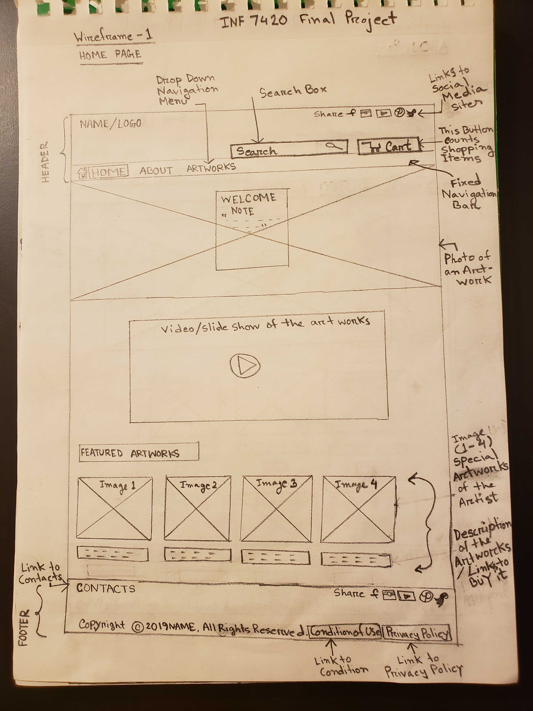
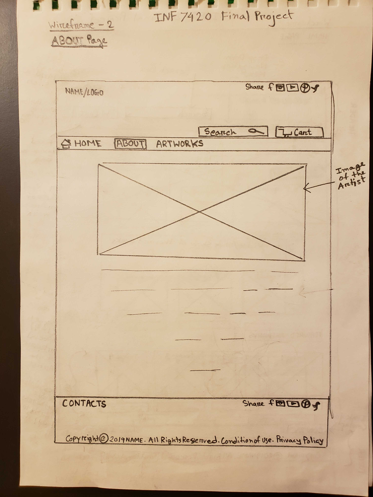
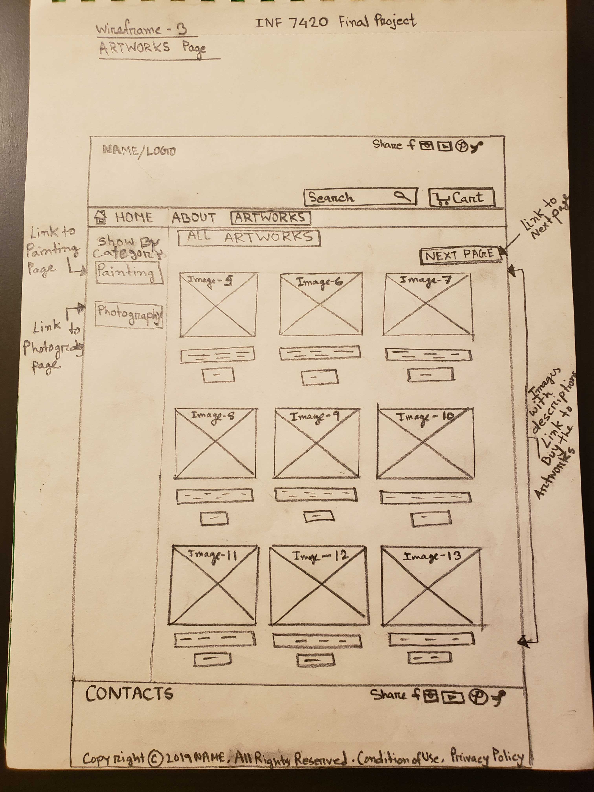

# My INF 7420 Project

For this project, I will create a website which will be a combination of my personal profile and E- Commerce site. The main purpose of the website is to show the artworks created by me and to sell them on my website.

## Wireframes

Here are the wireframes for the home, about and artworks pages of my website.

### Home Page

  
Header - will include the navigation menu, name of the website, shopping cart, and search options along with links to social media sites.

Navigation menu - will include links to main pages

Main content - will include a welcome note/message from the artist, photo of an artwork, a video of the artworks done by the artist along with the featured artworks.

Footer - will include links to contact info, social media sites, privacy policy, and condition of use, along with copyright info.

### About Page

Header - will include the navigation menu, name of the website, shopping cart, and search options along with links to social media sites.

Navigation menu - will include links to main pages

Main content - will include an image of the artist and a bio.

Footer - will include links to contact info, social media sites, privacy policy, and condition of use, along with copyright info.

### Artworks Page

Header - will include the navigation menu, name of the website, shopping cart, and search options along with links to social media sites.

Navigation menu - will include links to main pages

Main content - will include two sections. At the right hand side, there will be images of all artworks with their descriptions and links to buy them. At the left hand side, there will be a show by category menu along with the links to the individual category pages.

Footer - will include links to contact info, social media sites, privacy policy, and condition of use, along with copyright info.
